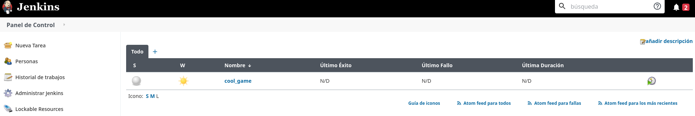
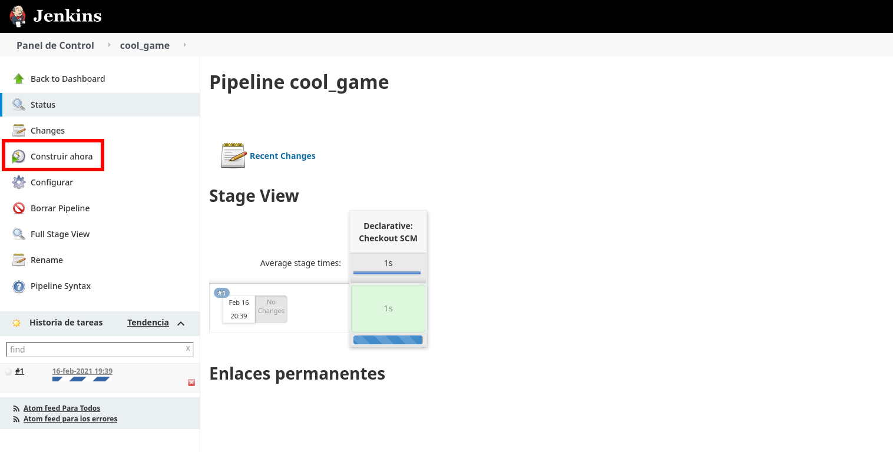

# CoolGame practise

This is a test project to build a simple C++ application

## Project Structure

This is the project structure

```
.
├── build
├── CMakeLists.txt
├── docker
│     ├── jenkins_job
│     │      ├── cool_game.xml
│     │      ├── Dockerfile
│     │      └── entrypoint.sh
│     ├── jenkins_master
│     │      ├── Dockerfile
│     │      └── jenkins-plugins.txt
│     └── jenkins_slave
│            └── Dockerfile
├── docker-compose.yml
├── Dockerfile
├── docs
│     ├── img_1.png
│     ├── img_2.png
│     ├── img_3.png
│     └── img.png
├── include
│      ├── Game.h
│      └── GameObject.h
├── Jenkinsfile
├── README.md
├── src
│    ├── CMakeLists.txt
│    ├── common
│    │     ├── CMakeLists.txt
│    │     ├── Game.cpp
│    │     └── GameObject.cpp
│    └── main.cpp
└── test
    ├── CMakeLists.txt
    ├── lib
    │    └── googletest
    └── test_GameObject.cpp
```

* `build` folder contains compiled files
* `docker` folder contains each container used in the project
    * `jenkins_job` is used to create project pipeline within jenkins 
      master through the API
    * `jenkins_master` is the master node of the jenkins platform
    * `jenkins_slave` is used to build and compile the application
* `docs` folder contains documentation content
* `include` folder contains headers files
* `src` folder contains the principal code of the application
* `test` folder contains all test and libraries for this purpose

> `cool_game` root folder contains different files like Jenkinsfile and 
> docker-compose.yml to build the project

## How to Build the project

The project is dockerized and is not necessary run commands in host 
terminal.

First step is building the images.

> This project does not use docker in docker behavior, instead it mounts 
> docker socket of the host to use docker command internally. This has a 
> restriction, before building it docker-compose need the gid of the 
> docker group passed as argument

With the next command docker-compose builds all containers

```
docker-compose build --build-arg docker_gid=<docker_gid>
```

With the last command 5 images are built

```
$ docker images | grep cool_game
REPOSITORY                   TAG       IMAGE ID       CREATED          SIZE
cool_game_local_build_run    latest    413e6b6c2bee   1 second ago     251MB
cool_game_local_build_test   latest    413e6b6c2bee   1 second ago     251MB
cool_game_jenkins_job        latest    07226d9fb938   10 seconds ago   18.9MB
cool_game_jenkins_slave      latest    541d9919409a   25 seconds ago   248MB
cool_game_jenkins            latest    c9d9ce0200f1   41 seconds ago   1.27GB
```

The first two of them are for local build, run and test, the others are for 
the CI/CD environment

Lets build and execute the game

* Run it
```
$ docker-compose up local_build_run
Building with native build. 
.
.
.
local_build_run_1   | Scanning dependencies of target cool_game_test
local_build_run_1   | [ 90%] Building CXX object test/CMakeFiles/cool_game_test.dir/test_GameObject.cpp.o
local_build_run_1   | [100%] Linking CXX executable cool_game_test
local_build_run_1   | [100%] Built target cool_game_test

local_build_run_1   | Hello World
cool_game_local_build_run_1 exited with code 0
```

* Test it
```
$ docker-compose up local_build_test
Building with native build.
local_build_test_1  | Running main() from gtest_main.cc
local_build_test_1  | [==========] Running 2 tests from 1 test case.
local_build_test_1  | [----------] Global test environment set-up.
local_build_test_1  | [----------] 2 tests from GameObjectTest
local_build_test_1  | [ RUN      ] GameObjectTest.CreateObject
local_build_test_1  | [       OK ] GameObjectTest.CreateObject (0 ms)
local_build_test_1  | [ RUN      ] GameObjectTest.FailTest
local_build_test_1  | /tmp/cool_game/test/test_GameObject.cpp:13: Failure
local_build_test_1  | Value of: true
local_build_test_1  | Expected: false
local_build_test_1  | [  FAILED  ] GameObjectTest.FailTest (0 ms)
local_build_test_1  | [----------] 2 tests from GameObjectTest (0 ms total)
local_build_test_1  | 
local_build_test_1  | [----------] Global test environment tear-down
local_build_test_1  | [==========] 2 tests from 1 test case ran. (0 ms total)
local_build_test_1  | [  PASSED  ] 1 test.
local_build_test_1  | [  FAILED  ] 1 test, listed below:
local_build_test_1  | [  FAILED  ] GameObjectTest.FailTest
local_build_test_1  | 
local_build_test_1  |  1 FAILED TEST
cool_game_local_build_test_1 exited with code 1
```

The next step is to build the project in Jenkins.

* Start Jenkins master

```
$ docker-compose up -d jenkins
```

Link to Jenkins UI http://localhost:8080

> It does not need to run the slave Jenkins node because the pipeline calls him directly.

At this point Jenkins is prepared with a list of plugins but there are no jobs created

* Create the cool_game job

```
$ docker-compose up jenkins_job 
Building with native build.
cool_game_jenkins_1 is up-to-date
Creating cool_game_jenkins_job_1 ... done
Attaching to cool_game_jenkins_job_1
jenkins_job_1       | 2021/02/16 19:32:22 Waiting for: http://jenkins:8080
jenkins_job_1       | 2021/02/16 19:32:23 Received 200 from http://jenkins:8080
jenkins_job_1       | Job created correctly
cool_game_jenkins_job_1 exited with code 0
```

> It is possible to run jenkins_job services without running jenkins_master 
> because the first is a dependency of the second



Now pipeline can run http://localhost:8080/job/cool_game/



After a few seconds pipeline finishes

The pipeline project is pointing to a public [github repository](https://github.com/jneilaglez/cool_game) 
owned by [jneilaglez@gmail.com](mailto:jneilaglez@gmail.com?subject=cool_game). 
If it is necessary to change and push the code configure other location 
in the pipeline.


# Improvements
* Create good `test` folder structure which modularize all classes with the
  same tree than the `src` folder.
* Improve the import method of the headers files without using full 
  relative path
  ```
  # ./src/common/CMakeLists.txt
  # Variables
  set(LIB_SOURCES
      Game.cpp
      GameObject.cpp
      ../../include/Game.h
      ../../include/GameObject.h)
  
  # ./test/test_GameObject.cpp
  #include "../include/GameObject.h"
  ```
* Improve security, size and other containers features
* Improve documentation 
* Improve the pipeline as well with library functions
* Enhance CMakeLists.txt declarations to improve their readability 
  and simplicity
* Create a main test class to execute all test and generate the 
  possibility to execute tests partially
* Use a real name for the documentation images
* Script to clean containerized solution

# Misc

The googletest suite is not included in the project, is downloaded 
directly within de containers. If is really needed to local development, 
just only download it inside `./test/lib/` path, and configure the IDE, 
cmake, make and other tools for building the project in the host.

```
git clone https://github.com/google/googletest.git ${COOLGAME_PATH}/test/lib/googletest
```

## Available commands

Some available commands to use

```
docker-compose up jenkins
docker-compose up jenkins_job
docker-compose up jenkins_slave
docker-compose up -d
docker-compose up local_build_run
docker-compose up local_build_test
```